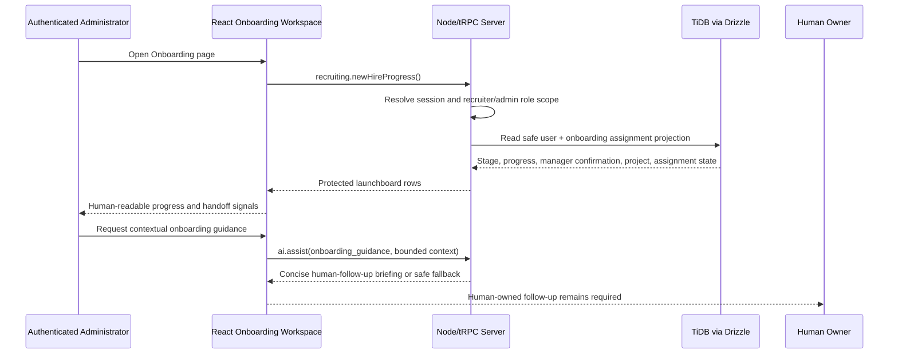

# Administrator Onboarding Page — End-to-End Assessment and Existing-Capability Prompt Guide

**Author:** Manus AI  
**Scope:** Authenticated Administrator experience of the managed Verton Workforce Hub Onboarding page  
**Evidence basis:** Current React workspace, managed Node/tRPC procedures, TiDB/Drizzle onboarding schema and helpers, role-navigation configuration, and current unit/browser-style tests.  
**Boundary:** This guide covers only existing onboarding, assignment, and human-handoff capabilities. It does not add a task-management database, document repository, e-signatures, policy distribution system, equipment inventory, notification service, background job, automatic reminder, automated staffing decision, work-authorization decision, or external integration.

## Executive assessment

The Workforce Hub already has a clear **database-backed onboarding assignment** foundation. The normalized `onboarding_assignments` table maintains one record per employee, with `onboardingStage`, `progressPercent`, `managerConfirmed`, `projectName`, `assignmentState`, and `updatedAt`. The managed `recruiting.newHireProgress` procedure returns a deliberately limited projection of those signals and is guarded by the existing recruiter procedure scope, which includes Administrator and Recruiter access. The projection intentionally excludes readiness metadata and document information.

The existing **Onboarding workspace page** is role-navigable by Administrator, HR & Compliance, Delivery Manager, and Consultant. However, its main checklist, selected-persona cards, progress indicator, checklist toggles, “Send reminder” control, and contextual examples are client-only representative interface data. Changes are held in React state and do not update `onboarding_assignments` or an operational activity record. The existing server procedure is already available for a database-backed Administrator onboarding view, but the page does not currently consume it.

| Area | Current implementation | Authoritative boundary | Assessment |
|---|---|---|---|
| Workspace entry | Managed cookie-backed authentication, protected routing, and role-scoped navigation | Administrator, HR/Compliance, Delivery Manager, and Consultant can navigate to Onboarding | Implemented |
| Database onboarding assignment | One `onboarding_assignments` record per user | Stage, percentage, manager confirmation, project name, assignment state, updated timestamp | Implemented |
| Protected launchboard query | `recruiting.newHireProgress` with safe onboarding/assignment projection | Administrator and Recruiter scope; rows are limited to `user` and `consultant` workforce roles | Implemented and tested |
| Onboarding stage vocabulary | `not_started`, `profile_in_progress`, `manager_confirmation`, `ready_for_assignment`, `assigned` | Workflow signals only; not a readiness or staffing decision | Implemented schema vocabulary |
| Assignment state vocabulary | `unassigned`, `pending`, `active`, `roll_off` | Operational assignment state only | Implemented schema vocabulary |
| Administrator page main content | Local personas, static checklist, client-only completion state | No server query or persistence is involved | Representative only |
| Checklist interaction | Local state toggles task completion and recalculates percentage | No task table, task procedure, or server mutation exists | Representative walkthrough only |
| AI briefing | Protected `onboarding_guidance` accepts bounded context and returns human-follow-up guidance | Context is bounded and excludes work-authorization status; no decision automation | Implemented |
| Reminder action | Current visual button has no authenticated notification handler | Notification/workflow automation is not an existing capability | Must remain non-operational or be removed from live administrative presentation |

## Current end-to-end architecture

The employee-oriented Onboarding component holds an `onboarding` array and selected persona in React state. Clicking a checklist row flips local `done` state and updates a local completion fraction. Changing the persona replaces the local array with a different static set. These interactions are useful as a representative interface demonstration, but they are not data-backed operations and must not be presented to an Administrator as persisted employee onboarding activity.

The managed backend already supplies a narrower, correct source for Administrator onboarding oversight. `listRecruiterNewHireProgress()` left-joins `users` and `onboarding_assignments`, returns only identifier/name/email/role and assignment workflow signals, and restricts rows to `user` and `consultant` workforce records. It does not select `employee_profiles`, status notes, readiness status, raw resume content, private upload metadata, candidate data, finance fields, or role-change history.

| Layer | Verified dynamic responsibility | Existing permitted data/actions | Explicit exclusions |
|---|---|---|---|
| React navigation | Selects the Onboarding page only for permitted workspace roles | Active-page routing and authorized page recovery | Client navigation cannot authorize API calls |
| React onboarding page | Shows a representative checklist and bounded AI action | Local task completion display; contextual human follow-up | Persisted task completion, notification sending, manager approval |
| Node/tRPC recruiting router | Delivers protected new-hire progress | Safe onboarding and assignment workflow row list | Readiness metadata, documents, finance values, candidate resume details |
| Node/tRPC AI router | Delivers protected onboarding guidance | Bounded 12–1,600 character context and human-owner guidance | Eligibility, authorization, hiring, staffing, or work-authorization decision |
| Drizzle data layer | Joins users to onboarding assignments | Existing stage, percentage, confirmation, project, assignment state | Task checklist rows, document links, reviewer notes, legal conclusions |
| TiDB | Stores normalized workflow assignments | One assignment record per user with current state | Raw files, credential secrets, document images |

## Verified tests and controls

Existing client tests verify that an authenticated Consultant can open Onboarding, toggle a representative checklist task, and see local completion move from two to three of five. They also verify that the onboarding AI action appears only in the active Onboarding workflow, sends bounded onboarding context, excludes `workAuthorizationStatus`, renders a returned briefing, and presents the designated-human-owner fallback when the AI provider is unavailable.

Server tests prove that non-recruiter roles cannot call `recruiting.newHireProgress` and that returned launchboard rows contain onboarding and assignment signals without `readinessStatus`. The current test suite does not prove a database-backed Administrator Onboarding page, real queue loading/error/empty states, role-specific rendering of the onboarding launchboard, or that representative checklist controls are visibly non-persistent. Those are the valid connection and transparency gaps.

| Gap ID | Verified gap | Risk if retained | Existing-capability remedy |
|---|---|---|---|
| OB-01 | Administrator Onboarding does not consume `recruiting.newHireProgress` | Static personas may be mistaken for actual onboarding assignments | Bind an Administrator launchboard to the existing protected query |
| OB-02 | Main checklist uses React-only state and static personas | Users could infer that task clicks update employee records | Label the checklist as an internal representative walkthrough or replace the Administrator view with assignment-stage cards |
| OB-03 | Page does not expose query loading, error, or empty states | Data-backed implementation lacks operational clarity | Add states around the existing query without adding a new API |
| OB-04 | “Send reminder” is visually present without a notification implementation | Button could imply external outreach or automation | Remove it from the administrative data-backed view or label it unavailable; do not implement email/SMS/notifications |
| OB-05 | Existing handoff logic is used in recruiter context, not a dedicated administrator rendering | Administrator lacks a neutral, data-derived way to focus follow-up | Reuse the existing stage/assignment handoff labeling without changing assignment state or recommending staffing action |
| OB-06 | Administrator page route and query behavior lacks direct browser-style regression coverage | Future changes could fetch restricted fields or bypass route scope | Add Administrator route, safe projection, and unavailable-state tests |

> **Human-ownership rule:** Onboarding stage, manager confirmation, project association, and assignment state are operational workflow indicators. They must not be interpreted as an authorization, work-readiness, suitability, eligibility, hiring, or staffing decision.

## Capability-constrained implementation prompts

Use the following prompts in order. Each uses the current managed Node/tRPC runtime, TiDB/Drizzle tables, existing `onboarding_assignments` signals, current role model, and current AI safeguards. No prompt creates a new workflow system or sensitive data category.

### Prompt OB-A — Database-Backed Administrator Onboarding Launchboard

> **Implement an Administrator Onboarding Launchboard using the existing protected `recruiting.newHireProgress` query.** Render only the safe current projection: employee display name, organizational role, onboarding stage, progress percentage, manager-confirmed flag, project association, assignment state, and `updatedAt`. Ensure the procedure remains accessible only to Administrator and Recruiter roles under the existing recruiter procedure boundary.
>
> Do not return or render readiness status, employment type, work-authorization metadata, status notes, identity documents, resume content, candidate fields, upload keys, commercial values, access-role history, or unrestricted user rows. Do not add a new database table. Add server tests for Administrator/Recruiter access, other-role denial, stage/assignment field scope, and excluded readiness fields.

### Prompt OB-B — Replace Static Administrator Personas with Assignment Signals

> **For the Administrator Onboarding page, replace static selected-persona content with a selected row from the protected launchboard.** The detail view may show only current onboarding stage, progress, manager confirmation, project name, assignment state, and last update. Use the existing stages `not_started`, `profile_in_progress`, `manager_confirmation`, `ready_for_assignment`, and `assigned`; use only `unassigned`, `pending`, `active`, and `roll_off` for assignment state.
>
> Keep employee checklist personas separate as visibly labeled internal representative interface examples, or omit them from the Administrator data-backed view. Do not create editable task rows, persistent checklist completion, documents, approval controls, readiness indicators, or staffing decisions. Add client tests for row selection, each state label, and absence of restricted fields.

### Prompt OB-C — Accurate Progress, Handoff, and Queue States

> **Derive Administrator Onboarding status display from the existing assignment fields.** Render `progressPercent` only as supplied by the protected query. Reuse the current neutral handoff indicators for manager confirmation, assignment follow-up, delivery handoff, and no-handoff state. Display a visible human-owner label, such as “Manager confirmation needed” or “Delivery handoff needed,” without selecting a candidate, changing an assignment, sending a notification, or recommending a staffing decision.
>
> Add loading, error, empty, and internal-demonstration-data states. Do not invent due dates, SLA breaches, risk scores, readiness scores, escalation levels, task completion counts, or assignment recommendations. Test queue counts, zero-record behavior, and every existing handoff label.

### Prompt OB-D — Preserve Representative Checklist Boundaries

> **Keep the current checklist interaction transparent.** If the local `onboardingDefaults` checklist remains in a permitted employee-facing demonstration view, label it as representative interface data and state that completion changes remain local to the current browser demonstration. Keep its toggles out of the Administrator launchboard and do not present them as database-backed employee activity.
>
> Do not add a task table, task mutation, event stream, document checklist, or automatic reminder. Do not use the local completion percentage in administrative metrics. Add a UI test that the representative label is visible and no tRPC mutation is issued when a demonstration item is toggled.

### Prompt OB-E — Scoped Contextual AI Guidance

> **Retain the current narrow `onboarding_guidance` action only within the active Onboarding workspace.** Build its bounded context from permitted onboarding stage, progress, manager confirmation, project association, assignment state, and neutral handoff text. Preserve the 12–1,600 character server-side bound and the designated-human-owner fallback if the provider is unavailable.
>
> Do not include `workAuthorizationStatus`, employee profile notes, readiness detail, documents, candidate profiles, resume content, commercial data, permissions, or user administration data in model context. Do not introduce an onboarding AI decision, automated reminder, or recommended candidate assignment. Test safe context projection, role gating through the page route, provider-unavailable fallback, and absence from unrelated pages.

### Prompt OB-F — Remove Non-Operational Reminder Implications

> **Audit the current visual “Send reminder” control in Onboarding.** Because notification delivery, email, SMS, and scheduled outreach are not existing capabilities, remove the active-looking control from the Administrator launchboard or replace it with clear disabled explanatory text: “Follow-up is owned by the designated human owner.”
>
> Do not add a notification API, external integration, background process, schedule, automated escalation, recipient directory, or delivery log. Add a browser-style test ensuring the administrative view contains no send action that can make an outbound request.

### Prompt OB-G — Administrator Routing and Query-Gating Regression Matrix

> **Add focused Administrator Onboarding regression coverage.** Verify that an unauthenticated `/workspace/onboarding` deep link resolves to secure login; Administrator, HR/Compliance, Delivery Manager, and Consultant navigation follows existing page rules; and only Administrator/Recruiter invoke the protected `newHireProgress` query. Verify that unsupported roles do not fetch or render onboarding launchboard data.
>
> Confirm the safe query projection, existing stage/assignment vocabulary, local-checklist transparency, role-scoped AI context, query loading/error/empty state, and no-send-reminder boundary. Preserve the managed Node/tRPC runtime and cookie-backed session. Do not deploy FastAPI, create a sidecar, or change authentication.

## Implementation order and acceptance conditions

The key correction is to separate the Administrator’s database-backed onboarding oversight from the representative personal checklist. OB-A establishes the protected data source. OB-B and OB-C connect it to the page and present current workflow signals honestly. OB-D through OB-F eliminate misleading persistence and outbound-action implications. OB-G preserves safe routing and tests all field/role boundaries.

| Order | Prompt | Completion evidence |
|---|---|---|
| 1 | OB-A | Protected launchboard query is rendered only for Administrator/Recruiter and returns the documented safe projection |
| 2 | OB-B | Administrator selection view uses existing onboarding assignments, not static personas, and presents no restricted data |
| 3 | OB-C | Progress/handoff labels are data-derived and remain human-owned workflow indicators |
| 4 | OB-D | Any local checklist is visibly representative and cannot be confused with persisted administrator data |
| 5 | OB-E | AI context is bounded to safe onboarding signals and falls back to a designated human owner |
| 6 | OB-F | No non-functional button implies external messaging or automated follow-up |
| 7 | OB-G | Route, API, data-projection, UI-state, and no-decision regressions pass |

## Out of scope by design

The following are not current Onboarding capabilities and must not be inferred from this assessment: persistent onboarding-task management; document collection or storage; document review; e-signatures; policy acceptance records; equipment inventory; access provisioning; calendar invitations; email/SMS/push notifications; reminder scheduling; background workflows; manager approval; employee eligibility determination; work-authorization review; staffing recommendation; candidate selection; automated assignment; onboarding scoring; external HRIS/ATS synchronization; or FastAPI deployment.

The existing scope is deliberately operational and human-directed: it can surface current assignment-stage signals, show neutral handoffs, and provide bounded context-specific guidance. It cannot make or automate workforce decisions.
