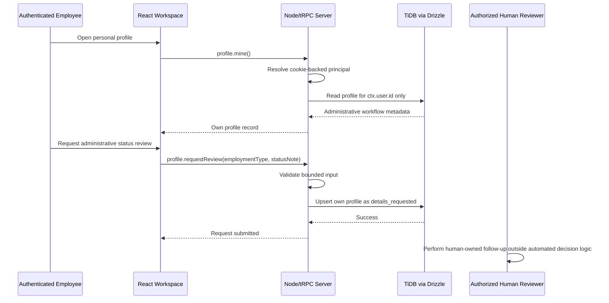

# Administrator Readiness Page — End-to-End Assessment and Existing-Capability Prompt Guide

**Author:** Manus AI  
**Scope:** Authenticated Administrator Readiness experience in the managed Verton Workforce Hub  
**Evidence basis:** Current React workspace, managed Node/tRPC procedures, TiDB/Drizzle schema and helpers, access-control tests, and existing role/AI contracts.  
**Boundary:** This guide describes only implemented capabilities and necessary hardening that connects them. It does not create an eligibility engine, immigration/legal workflow, document repository, background check, e-signature flow, external case-management integration, automated escalation, or automated employment decision.

## Executive assessment

The Workforce Hub has an intentionally narrow **readiness-status** data model. The `employee_profiles` table stores administrative workflow status, a short employment-type value, a bounded employee-entered status note, an optional expiry date, and update metadata. It deliberately excludes identity and work-authorization document copies. The active `profile.mine` and `profile.requestReview` procedures are protected and identify the record from the authenticated user ID; they do not accept a target employee ID from the browser. A profile update transitions the status to `details_requested`, leaving all review and employment decisions to people.

The visual **Readiness review** page is not yet connected to that profile data. It is a representative client-only table (`complianceRecords`) with a client-side masking toggle and static “actions due” label. The page correctly states the human-review boundary, but its review queue, names, categories, states, dates, and status pills are not currently derived from TiDB. There is also no current administrative profile-list procedure or HR/compliance review mutation. Therefore, the permitted next work is to make the Readiness page accurately represent the existing self-service status workflow—not to invent a complete compliance-management system.

| Area | Current implementation | Authoritative boundary | Assessment |
|---|---|---|---|
| Workspace access | Managed cookie-backed session, role-scoped navigation, and route recovery | Administrator and HR/Compliance can reach Readiness; unauthenticated access returns to secure login | Implemented |
| Employee workflow record | `employee_profiles` has one record per user | Stores status metadata only; no document bytes or images | Implemented data model |
| Employee self-service | `profile.mine` and `profile.requestReview` | Authenticated user ID is the sole profile key; update accepts 2–96 char employment type and 8–500 char note | Implemented and tested |
| Readiness status vocabulary | `not_started`, `details_requested`, `human_review`, `verified`, `expiry_watch` | Administrative indicators only, not legal or work-authorization conclusions | Implemented schema vocabulary |
| Administrator review queue | Static local `complianceRecords` in the current page | No protected list/query supports it yet | Representative only; must not masquerade as live data |
| Masking | Client-side name initials toggle | Helpful presentation control only; it is not server-side field authorization | Needs server-backed projection before live readiness data is rendered |
| Restricted records | No document table or file relation is part of employee readiness | Private resume storage is a separate recruiter workflow and must remain excluded | Implemented exclusion |
| AI | Administrator `access_review` briefing and Workspace Assistant exist | No readiness-specific AI task or readiness-record model context exists | Existing AI should not be expanded here without an explicit new capability |

## Current end-to-end architecture

The React workspace loads `trpc.profile.mine` for every authenticated session, then assigns that result to `visibleProfile`. The consultant-facing profile controls use `trpc.profile.requestReview`; on success, the page refetches the profile and displays a submitted state. The managed server uses a protected procedure for both endpoints. The database helper calls `getEmployeeProfile(ctx.user.id)` and `submitEmployeeProfileUpdate(ctx.user.id, input)`, preventing client-selected target records.

The update helper writes only `employmentType`, `statusNote`, `workAuthorizationStatus: "details_requested"`, and `updatedByUserId`. It uses an idempotent upsert on the unique user-profile relationship. This behavior is a request-for-human-review workflow. It neither validates documents nor determines authorization, eligibility, immigration status, job suitability, employment continuation, or compensation.

The current Readiness page is selected through the role-aware workspace navigation and uses the `masked` local state to present a static table. It shows a human-review warning, review queue, and masked/unmasked names. Because none of these rows use `profile.mine` or a protected administrative collection, the display must remain explicitly representative until an existing-field, server-projected queue is implemented.

| Layer | Verified dynamic responsibility | Existing permitted fields/actions | Explicit exclusions |
|---|---|---|---|
| React personal profile | Reads and submits the signed-in employee’s own status metadata | Employment type, status note, returned administrative status, submitted feedback | Target-user selection, document upload, decision outcome |
| React Readiness page | Human-review messaging and client masking of representative rows | Presentation-only human-review boundary | It must not claim static rows are live records |
| Node/tRPC `profile` router | Own-profile read and own review request | Authenticated ID, bounded inputs, `details_requested` result | Administrator-selected employee writes, automatic status approval |
| Drizzle `employee_profiles` | One workflow record per user | Employment type, five allowed states, note, optional expiry, updater/timestamps | Identity documents, work-authorization files, legal evidence |
| Role navigation | Limits which roles may open Readiness | Administrator and HR/Compliance workspace access | Navigation is not a substitute for procedure-level field checks |
| Current AI | Admin access-review briefings, bounded workspace assistant | Context-specific non-decision assistance | Readiness-record ingestion, eligibility advice, automated handoffs |

## Verified tests and controls

The server test suite verifies that an oversized status note is rejected before persistence and that `profile.mine` plus `profile.requestReview` always target the authenticated employee’s user ID. Existing role tests also prove that recruiter launchboard rows exclude readiness status. That is an important compartmentalization control: Recruiter workflow data and readiness data are not blended.

The current test suite does not prove a protected administrator readiness queue because no such endpoint exists. It also does not prove that client-side masking protects real fields, because the Readiness page is currently representative. These are implementation gaps. They must be solved by a minimal server-side projected listing and role checks before replacing the local review queue—not by adding sensitive documents or decision features.

| Gap ID | Verified gap | Risk if retained | Existing-capability remedy |
|---|---|---|---|
| RD-01 | Readiness review table uses static `complianceRecords` | Administrators may interpret illustrative rows as current protected workflow data | Replace the local array with a server-projected list composed only of existing `users` and `employee_profiles` fields |
| RD-02 | No administrative readiness-list procedure exists | No server layer defines which fields an Administrator/HR reviewer may read | Add a narrow `readiness.listProfiles` query with Administrator/HR-compliance role guard and safe projection |
| RD-03 | Existing `profile.requestReview` is correctly self-only, but no human reviewer state update exists | A UI status changer could accidentally turn metadata into an automated decision | Retain employee self-service only; do not introduce status mutation in this prompt set |
| RD-04 | The masking toggle applies only to client-side representative rows | It could be mistaken for access control when real records are introduced | Use server-side field projection first; retain masking solely as a presentation/privacy aid |
| RD-05 | Review-queue count and dates are static | Dashboard signals do not correspond to data records | Derive count and timestamps from existing profile status and `updatedAt` fields only |
| RD-06 | No readiness-specific browser-style Administrator tests | Protected query, masking behavior, and direct-route recovery are not demonstrated | Add tests around authorized safe projection, non-authorized denial, redaction, and route gating |

> **Human-review rule:** `workAuthorizationStatus` is an administrative workflow indicator. It cannot be treated as employment authorization, immigration advice, an eligibility result, a legal conclusion, a suitability score, or an employment decision.

## Capability-constrained implementation prompts

Use the prompts below in order. They are intentionally limited to the existing managed Node/tRPC runtime, TiDB/Drizzle `users` and `employee_profiles` tables, role model, UI shell, and test stack. They do not create new sensitive-data categories or broad reviewer powers.

### Prompt RD-A — Server-Projected Administrator Readiness Queue

> **Implement a protected Administrator/HR-Compliance Readiness queue using existing `users` and `employee_profiles` records only.** Add a narrow server-side query that is available only to `admin` and `hr_compliance`. Return a deliberately minimal projection: user ID, display name, employment type, `workAuthorizationStatus`, optional expiry date, `updatedAt`, and a derived “human review required” label where the existing state is `details_requested`, `human_review`, or `expiry_watch`.
>
> Do not return status notes by default, raw documents, identity document fields, candidate/resume fields, recruiter notes, upload keys, finance data, role administration history, or any user records outside the existing workforce directory. Do not add a status-change mutation. Test Administrator/HR access, all other role denial, and absence of excluded fields.

### Prompt RD-B — Database-Backed Readiness Page and Accurate Labels

> **Replace the Readiness page’s representative `complianceRecords` table with the protected readiness queue from the existing `employee_profiles` data foundation.** Keep the current human-review callout. Render only the existing workflow states: `not_started`, `details_requested`, `human_review`, `verified`, and `expiry_watch`, with clear plain-language labels that say “administrative workflow status” rather than readiness approval.
>
> Derive the queue count from returned records that require human attention and display `updatedAt` as the administrative review date. Include loading, error, empty, and internal-demonstration-data states. Do not invent workflow categories, due dates, risk scores, “ready” determinations, or a claim that document images are stored. Add deterministic UI tests for each returned state and zero-record state.

### Prompt RD-C — Server Projection Before Presentation Masking

> **Retain the existing Readiness page “Mask sensitive fields” control as a presentation-only privacy aid after the server-projected queue is in place.** When mask mode is on, display a consistently redacted name or initial pattern and omit the optional expiry date from the table. When it is off, render only the already-authorized server-projected fields. Explain in the UI that server-side access controls determine what data arrives and masking only reduces incidental on-screen exposure.
>
> Do not use client-side masking as an authorization substitute. Do not fetch hidden fields and conceal them with CSS. Do not include status notes, documents, or private data in component state. Add tests proving the API response lacks excluded fields and the mask control redacts only fields already permitted to the current role.

### Prompt RD-D — Preserve Employee Self-Service Request Flow

> **Keep the existing employee-owned profile request workflow distinct from Administrator Readiness review.** The signed-in employee may use `profile.mine` and `profile.requestReview` to submit only a 2–96 character employment-type value and 8–500 character administrative status note. The server must identify the profile from `ctx.user.id`, upsert the own record, set `workAuthorizationStatus` to `details_requested`, and set `updatedByUserId` to the same user.
>
> Do not let a client provide a target user ID. Do not let an Administrator act through this endpoint to edit another employee profile. Do not accept document content, document links, proof images, or legal status claims. Preserve the existing post-submit refetch and success state. Test own-profile isolation, input limits, and state transition.

### Prompt RD-E — Human-Owned Handoff and Operational Activity

> **Use existing operational activity records only to show a neutral human-owned handoff when a protected readiness queue record requires attention.** The display may state “human reviewer follow-up required” and route an authorized viewer to the Readiness page. Keep the underlying profile status immutable from this activity display; do not write a decision, auto-assign a reviewer, schedule a reminder, or generate an automatic escalation.
>
> If the existing data layer does not have a safe readiness-activity helper, retain a read-only callout instead of creating a new workflow. Do not introduce scheduled tasks, background workers, notifications, external email/SMS, or AI-generated action advice. Test that no activity surface exposes status notes or documents.

### Prompt RD-F — Readiness Role Navigation and Deep-Link Recovery

> **Make the existing Readiness route explicitly recover through the workspace role resolver.** An unauthenticated readiness deep link must show the secure login page. Administrator and HR/Compliance may reach the Readiness page. All other roles must recover to their currently permitted overview or page and must not make the protected readiness queue request.
>
> Preserve the managed cookie-backed session and existing Node/tRPC runtime. Do not add a FastAPI service, external hosting, or a second authentication path. Add browser-style tests for Administrator entry, HR/Compliance entry, non-authorized recovery, and unauthenticated routing.

### Prompt RD-G — No-Decision Guardrail Regression Matrix

> **Add a focused regression matrix for the existing readiness boundary.** Verify schema vocabulary, Administrator/HR safe queue access, non-authorized role denial, employee-owned request update, server-side excluded-field projection, client-side mask state, representative-data labeling, human-review callout, and route recovery. Include assertions that no procedure or UI copy claims to verify authorization, determine eligibility, make legal conclusions, authorize employment action, or recommend a hiring outcome.
>
> Do not test or implement decision automation, document validation, immigration advice, status approval, user impersonation, or bulk readiness exports. Keep the FastAPI artifact reference-only and keep Node/tRPC as the active managed runtime.

## Implementation order and acceptance conditions

The primary correction is the server-side projection. RD-A must precede any live readiness table because client-side masking cannot protect fields that have already been fetched. RD-B and RD-C then replace representative display behavior while maintaining a minimal, intelligible Administrator/HR interface. RD-D confirms the existing self-service path stays separated from privileged review scope. RD-E through RD-G strengthen handoffs, routing, and regressions without introducing an employment-decision workflow.

| Order | Prompt | Completion evidence |
|---|---|---|
| 1 | RD-A | Administrator/HR-only query returns the documented minimal existing-field projection; all other roles receive denial |
| 2 | RD-B | Readiness page renders real protected administrative workflow metadata with accurate states, counts, timestamps, and loading/empty/error states |
| 3 | RD-C | Masking is demonstrably supplemental; excluded sensitive fields are never delivered to the browser |
| 4 | RD-D | Employee self-service remains own-profile-only and creates a `details_requested` human-review handoff |
| 5 | RD-E | Attention information remains neutral and human-owned, without automated review decisions or notifications |
| 6 | RD-F | Login gate and role-specific deep-link recovery are tested for readiness access |
| 7 | RD-G | A focused test suite confirms safe projection, human-review language, and all decision exclusions |

## Out of scope by design

The following are not existing capabilities and must not be inferred from this Readiness review: uploading identity or work-authorization documents; storing document images; document OCR; remote verification; work-authorization verification; legal, immigration, or tax advice; eligibility determination; employee or candidate scoring; automatic escalation; reviewer assignment; scheduled expiry notifications; email/SMS; background checks; e-signatures; case management; payroll decisions; status approval mutation; mass export; or third-party compliance-system synchronization.

The Workforce Hub’s readiness scope is deliberately narrow: it provides controlled administrative workflow metadata and human review prompts. People, not the system, make every interpretation and action.
