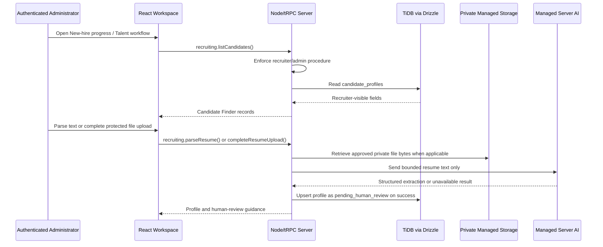

# Administrator Talent Pipeline — End-to-End Assessment and Existing-Capability Prompt Guide

**Author:** Manus AI  
**Scope:** Authenticated Administrator experience within the managed Verton Workforce Hub  
**Evidence basis:** Current React workspace, managed Node/tRPC procedures, TiDB/Drizzle schema and data helpers, private resume workflow, and focused unit/browser-style test contracts.  
**Boundary:** This guide describes only functionality already implemented in the repository or hardening needed to connect existing capabilities. It does not authorize new hiring, eligibility, work-authorization, payroll, CRM, customer-review, external-email, or external-integration workflows.

## Executive assessment

The authenticated Administrator can already access two distinct talent-related capability sets. The **New-hire progress** workspace is the protected, database-backed candidate workflow. It supports recruiter/admin-only plain-text and private PDF/DOCX resume parsing, automatic candidate-profile persistence with `pending_human_review`, Candidate Finder filtering, bounded inline candidate curation, and safe Workspace Assistant lookups. The managed Node/tRPC backend enforces the administrator/recruiter boundary for these calls; client visibility is supplementary.

The separate **Talent pipeline** page is presently a representative interface rather than a fully database-backed administrator view. Its candidate rows, stages, owners, detail panel, activity history, and demand cues come from local in-memory constants. Search and row selection work only against that representative data. The page has visible **Add talent profile**, **Filters**, and **Open profile** controls that do not invoke a protected backend action. The most important existing-capability hardening is therefore to reconnect this page to the already-built protected candidate workflow rather than create a new talent-management system.

| Area | Current implementation | Data and authorization boundary | Assessment |
|---|---|---|---|
| Workspace admission | Cookie-backed managed session, role-scoped navigation, and route recovery | Unauthenticated workspace routes return to login; unauthorized page requests normalize to an allowed overview | Implemented and tested |
| Talent pipeline page | Local representative candidate list, local search, selected-row detail panel | Visible in navigation to Administrator, Recruiter, Account Manager, and Delivery Manager; it does not call candidate APIs | Representative only; needs data-source and scope hardening |
| Candidate Finder | Candidate search, one-skill filter, experience bucket filter, count, review guidance, empty state | `recruiting.listCandidates` is protected by the recruiter procedure, which permits Administrator and Recruiter | Database-backed and tested |
| Resume parsing | Plain-text parser and protected PDF/DOCX upload completion | Administrator/Recruiter only; bounded text; original bytes remain in private managed storage | Database-backed and tested |
| Candidate curation | Inline name, location, experience, and skills update | Administrator/Recruiter only; Zod validation; update creates an activity record | Database-backed and tested |
| Candidate review state | `pending_human_review`, `reviewed`, and `archived` are persisted and displayed | Parse/upsert resets successful extraction to `pending_human_review`; no current user-facing review-state mutation exists | Displayed; state change is intentionally not a new prompt |
| Candidate exports | CSV/PDF exports for the current parsed result | Client-side export of approved parsed fields only; no raw resume/object key fields | Implemented and tested |
| Assistant lookup | Deterministic candidate lookup and short record list | Administrator/Recruiter only; only name, location, years, skills, and review state reach the model/chat | Implemented and tested |

## Current end-to-end architecture

The managed React workspace determines the active role from the protected `auth.me` query and resolves permitted pages before rendering. The Administrator has both **Talent pipeline** and **New-hire progress** navigation. The latter is currently the authoritative operational path because its candidate data comes from protected queries; it is also the route available at `/workspace/recruiting`.

The managed Node backend exposes `recruiting.listCandidates`, `recruiting.parseResume`, `recruiting.prepareResumeUpload`, `recruiting.completeResumeUpload`, and `recruiting.updateCandidate` under a recruiter-protected procedure. Administrator is accepted by this server policy. The same policy is the protection that matters when a client is manipulated; the sidebar alone is not the security control.

The normalized `candidate_profiles` table stores candidate name, contact metadata, location, professional summary, years of experience, skills, recent roles, education, recruiter notes, extraction confidence, review state, and timestamps. The separate `resume_uploads` table holds a relationship to the candidate profile and private object metadata. Its `fileKey`, original file name, MIME type, file size, uploader, and timestamp are never returned through the Candidate Finder projection. Original bytes remain in managed private object storage and are not database columns.

| Layer | Verified dynamic responsibilities | Current safe fields / actions | Explicit exclusions |
|---|---|---|---|
| React Talent pipeline | Representative search and selected-row panel | Local UI search and selection only | It must not be represented as a live candidate source |
| React New-hire progress | Live Candidate Finder, parser, upload, inline curation, export of parsed output | Name, contact metadata, location, experience, skills, review state, parser results | Raw resume text, private storage keys, readiness data, finance fields |
| `recruiting` tRPC router | Input validation and Administrator/Recruiter authorization | Text 80–12,000 chars; PDF/DOCX metadata ≤5 MB; inline skill list ≤20 | Anonymous calls and non-recruiter roles |
| Drizzle data helpers | Profile upsert, candidate list, controlled metadata update | Candidate profile presentation and activity entry for curation | Resume bytes and readiness/finance joins |
| Private resume upload route | Cookie-authenticated PUT to a recruiter-bound short-lived upload session | Session ownership, filename, MIME, size, expiry, one-time completion | Direct public object access and cross-user sessions |
| Managed AI | Strict structured extraction and concise assistant response | Bounded resume/lookup context and fallback to human review | Hiring, eligibility, compensation, work-authorization, or staffing decisions |

## Verified capability and test coverage

The parsed-candidate implementation is well covered for Administrator/Recruiter permission, bounded resume text, unavailable-provider behavior, candidate upsert, inline metadata validation, and a consultant denial. The direct-upload completion contract verifies short-lived session issue, private object retrieval, parsed-profile persistence, invalid metadata denial, non-recruiter denial, and no persistence on AI-unavailable fallback. Browser-style coverage verifies recruiter parse, upload, search, filters, exports, and inline edit interactions.

The gap is not a lack of candidate data capability. It is the mismatch between the **Talent pipeline** route's representative display and the protected candidate workflow already used elsewhere. There is also no dedicated Administrator browser-style test proving that the Talent pipeline route itself uses the protected query, and there is no explicit deep-link mapping for a Talent Pipeline URL. These are connection and verification gaps, not new business capabilities.

| Gap ID | Verified gap | Risk if retained | Existing-capability remedy |
|---|---|---|---|
| TP-01 | `Talent` renders local candidate and demand arrays instead of `recruiting.listCandidates` data | An administrator may mistake representative data for live candidate records | Recompose the Administrator/Recruiter Talent Pipeline around the existing Candidate Finder query and profile projection |
| TP-02 | Account Manager and Delivery Manager can enter the representative talent page although no protected candidate-list API is granted to them | Client-visible candidate-like details exceed the backend-supported recruiter scope | Remove candidate profile detail from those roles’ pipeline view or redirect them to their permitted delivery view; do not widen `recruiting` authorization |
| TP-03 | Add, Filters, and Open profile buttons are inert | Implies operations the platform does not currently perform | Replace them with navigation to existing parser/Candidate Finder capabilities, or render clearly non-actionable representative labels |
| TP-04 | No direct `/workspace/talent-pipeline` route mapping | Deep links resolve to overview instead of the permitted Talent Pipeline page | Add a permitted route mapping using the existing workspace route resolver and tests |
| TP-05 | Talent Pipeline browser-style tests are recruiter-centric and exercise the New-hire progress route | Administrator route integration is not demonstrated | Add Administrator-specific tests for query rendering, search, detail state, safe controls, and deep-link recovery |
| TP-06 | Local page stages and “profile strength” labels have no stored source or validation | Could be misread as an assessment or automated recommendation | Remove those synthetic metrics from the operational Administrator view; retain only persisted review state and extraction confidence, with human-review wording |

> **Interpretation rule:** Candidate records are recruiter-visible workflow metadata. Extraction confidence is not candidate quality, suitability, hiring likelihood, work authorization, or eligibility. Every visible review state requires human review.

## Capability-constrained implementation prompts

Use the following prompts in sequence. Each prompt is intentionally scoped to the existing managed Node/tRPC, TiDB/Drizzle, private-storage, and server-side AI capabilities. No prompt authorizes manual candidate creation, candidate deletion, automatic stage progression, hiring decisions, review-state changes, external emails, CRM synchronization, or any access expansion beyond the existing role policy.

### Prompt TP-A — Admin Talent Pipeline Data-Source Hardening

> **Implement the existing Administrator/Recruiter Talent Pipeline using the protected candidate workflow rather than representative local arrays.** When the active role is Administrator or Recruiter, drive the page from the existing `recruiting.listCandidates` query and recruiter-visible candidate profile projection. Preserve the existing candidate name, contact metadata, location, years of experience, skills, extraction confidence, recent roles, education, recruiter notes, and `pending_human_review` / `reviewed` / `archived` display. Render loading, result-count, and empty states. Clearly label seeded records as internal demonstration data when applicable.
>
> Do not query or render raw resume text, private object keys, upload sessions, work-readiness data, finance fields, role-administration details, or a candidate ranking. Do not create a new database table or a manual “Add talent profile” form. Keep server-side `recruiting` authorization unchanged. Add tests that an Administrator sees database-backed candidate records and a Consultant is denied the protected candidate procedure.

### Prompt TP-B — Talent Pipeline Role-Scope Reconciliation

> **Harden the existing Talent Pipeline navigation against unsupported candidate access.** Administrator and Recruiter may enter the database-backed Candidate Finder view because the existing protected router grants them recruiter workflow access. Account Manager and Delivery Manager must not receive recruiter-visible candidate profiles unless an existing server contract explicitly allows them. Replace their current representative candidate list with a safe, role-scoped handoff to the existing Delivery/Demand workflow, or remove Talent Pipeline from their navigation using the existing role resolver.
>
> Do not widen `recruiting.listCandidates`, parser, upload, candidate update, or assistant candidate lookup permissions. Do not expose contact metadata, resumes, readiness information, or human-review notes to non-recruiter roles. Test navigation recovery and direct URL recovery for each affected role.

### Prompt TP-C — Existing Candidate Finder Search, Filter, and Detail Surface

> **Connect the current Candidate Finder search experience to the Administrator Talent Pipeline.** Preserve existing search across candidate name, location, and skills; one extracted-skill filter; and 0–3, 4–7, and 8+ experience buckets. Present only the existing review-state labels: Human review pending, Human reviewed, and Archived. Add an accessible selected-candidate detail panel that renders only the fields already returned by the protected candidate projection.
>
> Include a result count, explicit human-review wording, a no-results state, and a clear close/return action. Do not introduce sorting by suitability, automated matching, stage progression, compensation, work authorization, or a manual candidate-creation flow. Add deterministic client tests for search, filters, detail selection, review labels, and empty state.

### Prompt TP-D — Resume Intake Handoff Within the Admin Pipeline

> **Replace the current inert “Add talent profile” affordance with a clear handoff to the existing protected resume intake workflow.** For Administrator and Recruiter only, route the action to the existing New-hire progress parser surface, which already accepts bounded plain text and protected PDF/DOCX upload sessions. Retain the existing limits: 80–12,000 characters for plain text; PDF/DOCX only; 5 MB maximum; short-lived uploader-bound session; server-side extraction; and successful upsert to `pending_human_review`.
>
> Show that original file bytes remain in private managed storage and are not candidate table fields. On managed AI unavailability, show the existing human-review fallback and do not create a candidate profile. Do not build email delivery, external applicant ingestion, manual profile entry, candidate scoring, or automatic employment decisions. Test Administrator access, non-recruiter denial, and safe fallback navigation.

### Prompt TP-E — Existing Candidate Curation and Operational Activity

> **Expose the existing inline Candidate Finder editor within the Administrator Talent Pipeline for human curation of recruiter-visible metadata.** Administrator and Recruiter may edit only existing candidate name, location, years of experience, and a bounded skill array of no more than 20 values. Retain controlled Edit, Save, and Cancel input state. Reuse the existing protected `recruiting.updateCandidate` mutation, server-side Zod validation, query refresh, and operational activity record.
>
> Do not make review state, contact data, resume source, readiness information, work authorization, compensation, candidate ownership, or hiring stage editable. Describe this explicitly as human curation—not automated enrichment. Test Administrator/Recruiter success, non-recruiter denial, invalid values, cancel-without-save, query refresh, and activity creation.

### Prompt TP-F — Parsed-Result Export Boundary

> **Keep the existing CSV/PDF export action limited to the current successful parsed resume result.** Generate a sanitized candidate-based filename and export only candidate name, contact details, location, experience, skills, education, summary, and human-review notes. Keep export client-side as it is today and ensure deterministic CSV row and PDF text behavior.
>
> Do not add bulk export, persistent-candidate export, raw source-resume export, upload-key export, readiness/authorization export, finance data, user role information, or external file sharing. Add tests for filename sanitization and forbidden-field exclusion.

### Prompt TP-G — Bounded Administrator Assistant Candidate Lookup

> **Expose the existing Workspace Assistant candidate lookup in the Administrator Talent Pipeline only when the authenticated administrator asks a bounded candidate-related question.** Reuse deterministic trigger detection and the existing short record list. The assistant may receive only candidate name, location, years of experience, skills, and review state as structured lookup context, then render the existing “Database matches” panel alongside the concise non-decision assistant reply.
>
> Do not send unrestricted database rows to the model. Do not expose contact metadata through the assistant unless a current approved projection permits it; do not expose raw resumes, private storage keys, recruiter notes, readiness data, role-administration records, finance values, or a hiring/eligibility recommendation. Retain 4–600 character prompt and 2–64 character page bounds. Add Administrator candidate-match, unsupported-role, prompt-limit, model-context, and browser-style rendering tests.

### Prompt TP-H — Talent Pipeline Deep-Link and Regression Contract

> **Add a stable permitted Talent Pipeline deep link using the existing workspace route resolver, without changing authentication or server runtime.** An unauthenticated request must show secure login. An authenticated Administrator or Recruiter requesting the Talent Pipeline route must receive that allowed page. A role without candidate-pipeline permission must recover to its existing allowed overview or permitted delivery handoff. Preserve cookie-backed session behavior and server-enforced API authorization.
>
> Add a compact regression matrix covering login gating, Administrator database-backed Candidate Finder render, Recruiter parity, non-recruiter API denial, parser/upload handoff, inline curation, assistant lookup, no raw resume/object-key leakage, and direct-route recovery. Do not add a new backend runtime, external hosting, external database, background worker, or scheduled task.

## Implementation order and acceptance conditions

The priority is to correct the existing data-source boundary before adding visual refinements. TP-A and TP-B address the representative-versus-operational ambiguity and prevent role scope from exceeding the current server contract. TP-C through TP-G then connect existing protected capabilities into a coherent Administrator experience. TP-H makes the completed workflow stable under direct navigation and guards against regressions.

| Order | Prompt | Completion evidence |
|---|---|---|
| 1 | TP-A | Administrator/Recruiter Talent Pipeline consumes the protected candidate query; representative rows no longer impersonate operational profiles |
| 2 | TP-B | Account/Delivery roles do not receive recruiter-visible candidate information; server roles remain unchanged |
| 3 | TP-C | Search, filter, count, empty state, selected detail, and human-review wording are deterministic and tested |
| 4 | TP-D | Administrator can reach the existing parse/upload intake; provider failure does not persist a profile |
| 5 | TP-E | Server-validated human metadata curation refreshes the candidate query and records activity |
| 6 | TP-F | Parsed-result-only export stays privacy-scoped with tested filenames and content |
| 7 | TP-G | Bounded safe candidate matches render in the existing assistant panel with no decision language |
| 8 | TP-H | Authenticated deep link and role recovery work; full regression contract passes |

## Out of scope by design

The following are not implemented capabilities and must not be inferred from this Talent Pipeline review: applicant sourcing integrations, job requisition creation, interview scheduling, manual candidate creation, candidate deletion, pipeline-stage mutation, scoring or ranking, automated selection, background screening, work-authorization determination, immigration/legal advice, compensation recommendations, payroll, email/SMS delivery, client portal sharing, CRM sync, bulk candidate export, or testimonials/reviews.

The database and AI safeguards remain central. The system stores a recruiter workflow profile and private file metadata; it does not convert that metadata into an employment decision. Human recruiters and administrators remain responsible for review and any later action.
