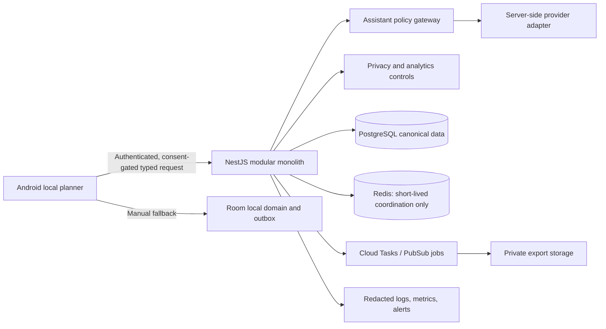

# Project Polaris Foundation Architecture

## Current boundary

This repository now contains a standalone `project-polaris/` monorepo beside the existing workforce-hub application. It is intentionally additive. The current code implements a safe Prompt 13 foundation, not a complete Android V1: the existing Prompt 01–12 production modules were not present in the selected repository.

The illustrated database, queue, storage, Firebase, and provider integrations are architectural targets. The checked-in foundation intentionally uses in-memory adapters and a rejecting token verifier by default, so no unreviewed external service or student data is accessed.

## Assistant flow

1. A learner selects an allowed assistant feature and content.
2. Android presents a localized disclosure and retains local manual fallback.
3. The backend verifies authentication, workspace ownership, feature state, current consent, request size, and policy eligibility.
4. A server-only provider adapter may return strictly structured draft data.
5. The learner edits/selects/rejects the draft. A model cannot write local or cloud data.
6. An opaque short-lived confirmation receipt binds the request to account, workspace, draft, revision fingerprint, capability, and selected candidates.
7. Only normal offline-first domain use cases may apply an approved change and record their outbox operation.

## Data classification summary

| Class | Examples | Handling |
|---|---|---|
| Learner content | Task, note, Inbox text, share text, course/subtask name | Local first; never logged or used for analytics; selected only with explicit AI disclosure. |
| Sensitive credentials | Firebase token, provider credential, database URL, signed URL | Secret Manager or runtime only; never Android source/logs/artifacts. |
| Consent and policy metadata | Capability, decision, policy version, time, locale | Minimum necessary, access controlled, no source text. |
| Operational metadata | Request ID, safe status/error code, latency bucket | Low-cardinality/redacted; never content or user identity. |
| Product analytics | Approved event name/property only after consent | Allow-list-only; no content/schedule/identity/device fields. |

Detailed rules are in `docs/ai-safety.md`, `docs/analytics-data-dictionary.md`, `docs/privacy-dashboard.md`, and `docs/deployment.md`.
